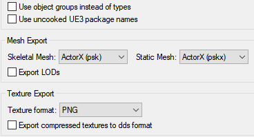

<<<<<<< HEAD
**This Page is still a work-in-progress.**
	<h3>**Extracting Game Assets**</h3>

To get started on creating mods for **Minecraft Dungeons**, you first need to unpack the game files to be able to edit them.
To do that, you need the following:  

!!! Note "Prerequisites"
		**[QuickBMS](https://aluigi.altervista.org/papers/quickbms.zip)**,  
		**[The Dungeons script for QuickBMS](https://drive.google.com/file/d/1iRnav4y9PyvTvGWmUqHZcaRGrGSAVDh5/view?usp=sharing)**,  
		**The game, launcher or Windows Store version (After following "[Installing Mods](https://docs.dungeonsworkshop.net/gettingstarted/)")**  

1. Extract **QuickBMS** into a folder.  
2. Put the Dungeons script into the same folder as **QuickBMS**.  
3. Start **QuickBMS**. It will prompt you to select a .bms file, choose the Dungeons.bms file in the same folder.  
4. In the next window, navigate to your **Minecraft Dungeons** installation directory.  

	!!! Note
		(For Windows Store, you need the folder you chose when you were following **"[Installing Mods](https://docs.dungeonsworkshop.net/gettingstarted/)"**)
  
5. Navigate into the Dungeons/Content/Paks folder, and select all **pakchunkX-WindowsNoEditor.pak** files. 
6. In the next window, select the **output** folder where the extracted game assets should be saved.
7. The script will now unpack the .pak files. When it is done, press **Enter** to exit.

  !!!  Note 
  You can also repeat this process for all mod .pak files, to see what the mod contains or what it's made of.
  !!! Note 
			(If the Launcher displays "Repair", just click on that button to start the update.)

=======
## Extracting Game Files

!!! Note "The Difference Between QuickBMS and UModel"
	**QuickBMS** will give you .uasset files & some other files like **block textures and level json's**  
	**UModel** extracts images and raw files, these will be things like **loading screens, models, animations, textures, etc.**

### Using QuickBMS

1. Download [QuickBMS](https://aluigi.altervista.org/papers/quickbms.zip) and the [Dungeons Script](https://drive.google.com/file/d/1iRnav4y9PyvTvGWmUqHZcaRGrGSAVDh5/view?usp=sharing).  
3. Extract the **QuickBMS zip** and launch **QuickBMS.exe**.  
4. Find and select the **Dungeons script** you downloaded and **press open**.  
5. Go to `%localappdata%\Mojang\products\dungeons\dungeons\Dungeons\Content\Paks` and select all of the files, then **press open**.  
This is so it selects all .PAK files from within this window.  
6. Create or select the **output directory** you wish the **extracted files** to be placed into.  
7. Press **ENTER** to finish.  

!!! Note
	**It may take a while to finish depending on your computer**

### Using UModel

1. Download [UModel](https://www.gildor.org/en/projects/umodel#files)  
2. Extract the **UModel zip** and Launch **umodel.exe  
3. To the right of the Path bar click the box and it should open up a window.
4. Navigate to `%localappdata%\Mojang\products\dungeons\dungeons\Dungeons\Content\Paks` and press **Select Folder** at the bottom of the window.
5. Check the **Override game detection** box.
6. Select **Unreal engine 4** for first drop down and **Unreal engine 4.22** for the second.
6. Check all the **Export-only classes** boxes.
7. Press **OK** and wait for it to index all the files *(this may take a while)*.
8. Once it is finished another window will pop up, Make sure **Flat View** is unchecked.
9. Right click on **All packages** folder at the top and click export folder contents
10. Set the directory to where you want the files to be extracted too.
11. Set the settings as shown.  

12. Press **OK** to finish.

## Swaping Textures
Work In Progress

## Custom Models
Work In Progress

## Custom Animation
Work In Progress

## Custom Armature
Work In Progress

## Custom Levels
Work In Progress

## Re-Packing Mods
Work In Progress
>>>>>>> a5727661cee6c95a930c0c8abcd280730b555f9c
